# Advanced Sitecore Healthcheck
The repository contains source code and documentation for the Advanced Sitecore Healthcheck Application.
[Detailed Documentation](https://docs.advancedschealthcheck.com/)

# Table of Contents
* [Introduction](#Introduction)
    * [Purpose](#Purpose)
    * [Supported Sitecore Versions](#Supported-Sitecore-Versions) 
    * [Releases](#Releases)
    * [Installation](#Installation)
        * [ConfigurationFiles](#Configuration-files)
    * [How this is working](#how-this-is-working)
        * [Component groups & items](#component-groups-and-items)
            * [Component item templates](#component-item-templates)
    * [Scheduled Task](#scheduled-task)
    * [Client application](#client-application)
        * [Start page](#start-page)
        * [Buttons and clicks](#buttons-and-clicks)
        * [Table view](#table-view)
* [Usage](#usage)
    * [Configuring the email and logging period settings](#configuring-the-email-settings-and-logging-period)
    * [Creating new healthcheck](#creating-new-healthcheck)
    * [Different component](#different-components)
        * [Database](#Database)
        * [API](#Api)
        * [Licence](#licence)
        * [Xdb](#Xdb)
        * [Certificate](#certificate)
        * [Applicaton Insight](#application-insight)
        * [Logs](#logs)
        * [Keep Alive](#keep-alive)
        * [Item](#item)
        * [Search](#search)
        * [Windows Services](#windows-services)
        * [WebJobs](#webjobs)
        * [Queues](#queues)
        * [Custom](#custom)
            * [How to implement a custom healthcheck](#how-to-implement-custom-healthcheck)
* [Configure the development environment](#configure-the-developer-environment)


# Introduction

* [BlogPost](https://tinyurl.com/ybq26ay8)
* [Demo Video](https://www.youtube.com/watch?v=J_qk7jT_Y-U)

## Purpose
The purpose of this module to check up Sitecore components if they are working correctly and notify the devs/devops engineers in time about a possible failure or just send a reminder about some upcoming expiration (e.g licence or certificate)


## Supported Sitecore Versions

- Sitecore 9.0
- Sitecore 9.0 Update-1
- Sitecore 9.0 Update-2
- Sitecore 9.1 
- Sitecore 9.1 Update-1
- Sitecore 9.2
- Sitecore 9.3 

## Releases
- 1.0  - [package](sc.package/Advanced.Sitecore.Healthcheck-1.0.zip)
  - Initial Release
  - Hotfix for initial release [package](sc.package/Advanced.Sitecore.Healthcheck.Hotfix.20200521-1.0.zip)
  - Download and install the hotfix package. (It only contains file changes, it will not update your configured items)
    - **Fixes**
    - 'ReRun' option returned wrong orders of error entries
    - Added ?sc_site=shell querystring to each API call, it makes sure to using proper site 
    - Added language switcher, the healtcheck may not work properly if your Default Content Language is not 'en'
- 1.0.1 - [package](sc.package/Advanced.Sitecore.Healthcheck-1.0.1.zip)
  - Contains hotfix #1
  - Fixing performance issue in Search Component check
  - Fixing an issue in Search Component Check - exception has been throwed when 'Run' button was clicked in the application
- 1.1.0 - [package](sc.package/Advanced.Sitecore.Healthcheck-1.1.0.zip)
  - Moving models into customization project
  - Adding Readonly repository to customization project
  - publishing customization project on [Nuget.org](https://www.nuget.org/packages/AdvancedSitecoreHealthCheckExtensions/1.1.0)

## Installation

Provide detailed instructions on how to install the module, and include screenshots where necessary.

1. Use the Sitecore Installation wizard to install the [package](sc.package/Advanced.Sitecore.Healthcheck-1.0.zip)
2. Make sure if your search indexes are working correctly
3. Go the LaunchPad and open the Healthcheck

### Configuration files
The package contains a configuration patch, which sets the "Sitecore.Services.SecurityPolicy" to "ServicesOnPolicy" - it is required for the Speak application.

**Settings in the Sitecore.Healthcheck.config**


| Key        | Value           |
| ------------- |:-------------:| 
| Healthcheck.MaxNumberOfThreads      | Sets the maximum number of threads which will be used during running healthcheck | 

## How this is working

### Component groups and items
The component groups and items can be found on */sitecore/system/Modules/Healthcheck Module/Components* Sitecore paths.
These groups are logical groups, you can rename them or move components to an another group.
The default installation contains the following component groups. 

| Group        | Description           |
| ------------- |:-------------:| 
| Xdb      | xDb related components configuration. (XConnect API, Windows services/Web Jobs)|
| Databases| Database related components configuration|
|API | Custom API related components configuration|
|Application Insight | Application Insight related configuration |
|Certificates | Certificate expiration configurations |
|Items|Item checking related configuration |
|Licence| Licence file expiration related configuration|
|LogFiles | Log files related configuration |
|Search Indexes | SearcIndex related configurations |

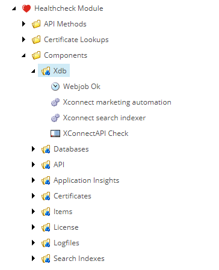

#### Component item templates
Every different Component item have two different section. 
The Data section should not be touched by Sitecore user, they updated by the scheduled task/healthcheck run. 
The configuration section is used for configuration the given component type. See these fields in the *Different components* section.
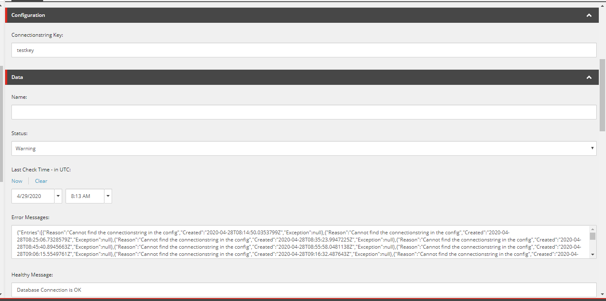
The Data section's fields are updated by the healthcheck process and displayed on the Healthcheck UI.

|Field|Description|
|-----|-----|
|Name| Name of the component which is displayed on the UI/ Status email. If it is empty, The current item' name is displayed|
|Status| The status of the current component. It can be **Healthy**, **Warning**, **Error** or empty (displayed as **Unknown** on the UI)|
|Last Check Time | The time when the last healthcheck run happened in UTC timezone|
|Error Messages| A field for storing historical error messages in JSON format. It stores error/warning messages for a given time period. This period is configurable on the **Settings** item. (see here)|
|Healthy Message| A message is used to display when the component is healthy. Some components uses this field, some components generates this message automatically|
## Scheduled Task
The following scheduled tasks and commands are created after the installation. 

**/sitecore/system/Tasks/Schedules/Healthcheck/Healthcheck Update Task**

**/sitecore/system/Tasks/Commands/Healthcheck/Healthcheck Update Command**

This scheduled task iterates through all Component items and runs the healthcheck on them.
## Client Application
The shortcut of the client applications is located on the Launchpad, in the **Control Panel** section.
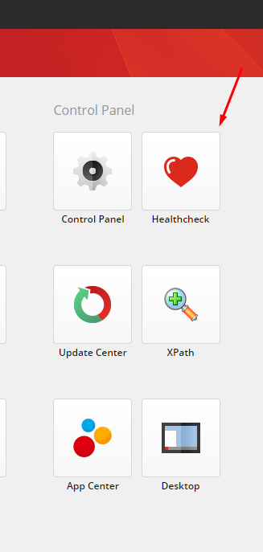

### Start page
If you open the UI application, you should see the following screen. 
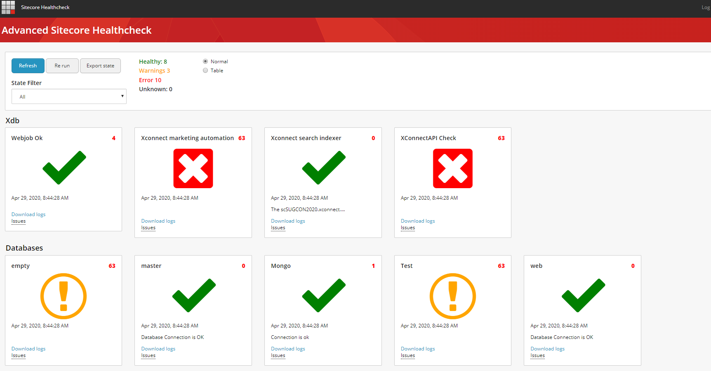

The application displays immediately the components statuses. Open the application or refreshing by pressing F5 **does not trigger** a healthcheck run. It only displayes the values, from each components' Data section.
The following data are displayed.
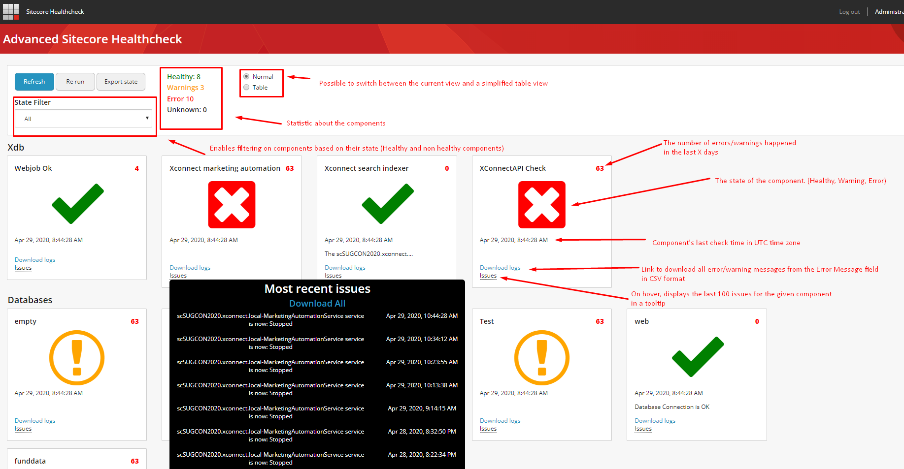

### Buttons and clicks
There are three buttons in the UI which you can use. 

|Button|Description|
|---|---|
|Refresh | Refreshes the component states, it does not trigger a healthcheck run|
|Re run| Triggers a healthcheck run, and refreshes the components |
|Export state| Export all components' state in CSV format|

You can do double click on each component. The double clicks triggers a healthcheck run on the given component and will display the new status.
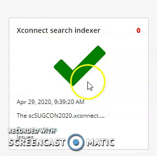

### Table View
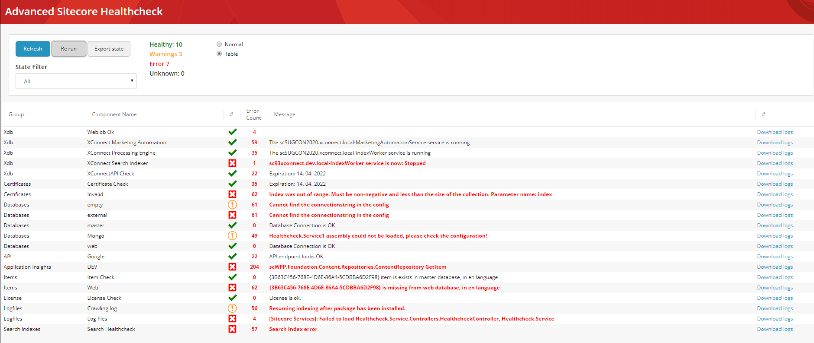


# Usage
Module related items can be found on `/sitecore/system/Modules/Healthcheck Module` path
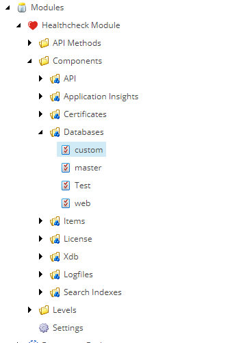

## Configuring the email settings and logging period    
The Settings item can be found on **/sitecore/system/Modules/Healthcheck Module/Settings** path

|Field|Description|
|--|---|
|Days|Defines the number of days after the error messages will be deleted|
|Sender Name| Sender name for the status email|
|Sender Email | Sender email address for the status email|
|Recipient Emails| Recipient email addresses, ';' seperated list. e.g user@mail.com;user2@mail.com|
|Subject|Subject of the email address|
|Error Level|Defines the error level when automatic email should be send|

**Email Error levels**
* Healthy - Email is sent after every healthcheck run
* Warning - Email is only sent if there is at least one component with Warning/Error state
* Error - Email is only sent if there is at least one component with Error state

**Smtp Configuration**
Smtp can be configured in the Sitecore.config with the following settings: 
MailServer, MailServerPort, MailServerUserName, MailServerPassword, MailServerUseSSL

## Creating new healthcheck
### Creating new Component Group
Navigate to the Components folder. (/sitecore/system/Modules/Healthcheck Module/Components)
Right click on the Components folder and select Insert/Component Group template.
Enter a name for the group.
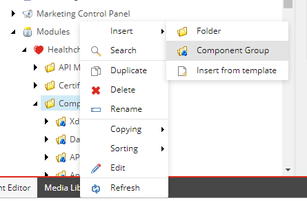

Right click on the Components folder and  select Insert and select one of the component template.
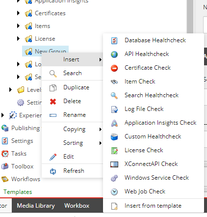

Configure the newly created component. (see below)

### Different Components

#### Database

|Field|Description|
|----|---|
|ConnectionString key| A connectionstring key which is located in the ConnectionString.config|

The healthcheck gets the connectionstring key, tries to read from configurations and tries to connect to the MSSQL database.

Returns warning when: 
* Connectionstring key field is empty
* Connectionstring cannot be found in the configuration

Returns error when:
* Connection cannot be built

#### API

|Field|Description|
|---|---|
|API Url|The Url of the API|
|Method| Get or Post|
|Expected Response Code| The expected http response code|
|Expected Response Body| The expected response body, it only verifies if this field is not empty|
|Post Body| Body which will be used if the selected method is POST|
|Request Headers| Request headers that will be attached to the request|

The healthcheck gets the API Call, setup the request (POST,GET, Body) and calls the endpoint. 
It checks if the response code is the expected and checks to response body if it is provided in the Expected Response Body field.

The API Healthcheck supports the following authentications.
* Certificate Authentication
* JWT Authentication
* Basic Authentication

**How to add authentication to the request?**
The different authentication configuration items can be inserted to the API component as child item.
If there is no authentication option child item of API element, it wont try to authenticate when calls the endpoint.
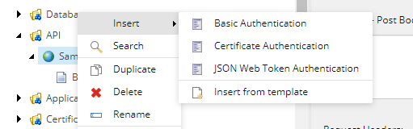

**Basic Authentication**

|Fields|Description|
|---|--|
|Username|Username for the basic auth|
|Password | password for the basic auth|


**Certificate Authentication**

This option will load the given client certificate.

|Fields|Description|
|---|---|
|StoreName| Drop list, certificate stores to lookup the certificate|
|Location| Drop list, location to lookup the certificate|
|FindByType| Droplist, define the find by type to lookup the certificate|
|Value| Value to find the certificate|


**JWT Authentication**

This option will request a token first which will be used in the API component healthcheck.

|Fields|Description|
|--|--|
|Username|Username to get the token|
|Password| Password to get the token|
|Generate Token Url|Url to call and receive the token|
|Method|POST or GET|
|Token|If you have a token with long expiration, you can store here. If it has any value, then the **Generate Token Url** endpoint will not be called.|

Returns warning when
* The fields are not configured properly

Returns error when
* The expected response code does not match
* The expected response body does not match

#### Licence

|Field|Description|
|----|---|
|WarnBefore| Sets the number of days to display a warning before the licence expires|
|ErrorBefore| Sets the numboer of days to display an error before the licence expires|

The healthcheck reads the **expiration** node from the licence file and compares the calculated datetime (DateTime.UtcNow.AddDays(-WarnBefore))

Returns warning when:
* expirationDays.AddDays(-WarnBefore) <=DateTime.UtcNow.Date
Returns error when:
* expirationDays.AddDays(-ErrorBefore) <=DateTime.UtcNow.Date

#### xDb 

**This method is only available from Sitecore 9.3 to check XDb related services.** 
Otherwise please use API healthcheck to verify your Xdb related APIs.

This section only describes the XConnXDB related API healthchecks. 
Healthchecking MarketingAutomation, ProcessingEngine, and SearchIndexer services, 
please visit the  [Windows Services](#windows-services) and [WebJobs](#webjobs) sections.

|Field|Description|Possible values|
|---|---|---|
|XConnect Api ConnectionString Key| Connectionstring key for the XDb API in the Connectionstrings.Config|xconnect.collection,xdb.marketingautomation.operations.client,xdb.marketingautomation.reporting.client,xdb.referencedata.client,sitecore.reporting.client,xdb.referencedata.client|
|XConnect Certificate ConnectionString Key| Connectionstring key for the XConnect API Clientcertificate in the connectionstring.config|xconnect.collection.certificate,xdb.marketingautomation.operations.client.certificate,xdb.marketingautomation.reporting.client.certificate,xdb.referencedata.client.certificate,sitecore.reporting.client.certificate,xdb.referencedata.client.certiciate|
|WarnBefore| Sets the number of days to display a warning before the xconnect client certificate expires||

The healthcheck reads the certificate and xconnect api connectionstrings and it tries to call {XConnectApiHost}/healthz/live endpoint.
**This endpoint is only available in Sitecore 9.3**

This is the XConnect api built-in healthcheck endpoint which has certificate authentication. It is healthy, when the returned response code is 200.
You can read more about this endpoint in the [Official Documentation](https://doc.sitecore.com/developers/93/platform-administration-and-architecture/en/monitoring-the-health-of-web-roles.html)

Returns warning when: 
* Xdb.Enabled settings set to false
* XConnect API and XConnect Certificate connectionstring key fields are empty or cannot be found in the connectionstring.config
* XConnect API Client Certificate will expire soon* 

Returns error when:
* XConnect Certificate: cannot be found, multiple certificate found, expired
* XConnect API healthz/live endpoint response code is not 200

#### Certificate

|Field|Description|
|----|---|
|StoreName| Drop list, certificate stores to lookup the certificate|
|Location| Drop list, location to lookup the certificate|
|FindByType| Droplist, define the find by type to lookup the certificate|
|Value| Value to find the certificate|
|WarnBefore| sets the number of days to display a warning before the certificate expires

The healthcheck tries to read the certificate based on the configured parameters and validates the expiration date.

Returns warning when
* Any of the following fields have empty value: StoreName, Location, FindByType, Value
* Certificate expires in the WarnBefore interval (certificate.NotAfter.AddDays(-WarnBefore)<=Datetime.Now.Date)


Returns error when
* Certificate cannot be found the configured store/location
* When multiple certificate are found in the configured store/location
* When the certificate expired (certificate.NotAfter.Date>DateTime.Now.Date)

#### Application Insight

|Field|Description|
|--|---|
|Application ID| Application ID of AppInsight instance, it can be retrieved from Azure Portal|
|API Key| Key to access the AppInsights. It can be generated on Azure Portal|
|Number of Days to Check| Defined the number of days to retrieve logs from AppInsights|

The healthcheck calls the https://api.applicationinsights.io/v1/apps/ API which returns the errors/warnings from Application Insights. 

**How to get Application Insight Application ID and API Key?**

* Open the AppInsights on the Azure Portal
* Navigate to **Configure** section and click on **API Access** option. 
* Copy the Application ID from the Application ID field
* Create a new API Key with the API Key button
* Copy the newly created API Key

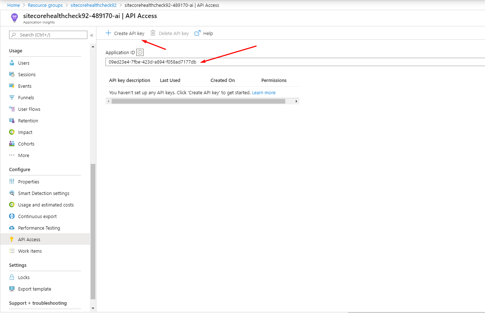


returns warning when
* Any of the following fields have empty value: Application ID, ApiKey
* Could not get any request from AppInsight API
* If there is any warning in the AppInsight logs in the given interval

Returns error when
* If there is any error in the AppInsight logs in the given interval

#### Logs
todo

#### Keep Alive

Keep Alive check does not have any fields for configuration. 
It calls the /sitecore/service/keepalive.aspx and verifies is the response code is 200.
By default, it uses the server url as host. (WebUtil.GetFullUrl(keepAliveUrl))

Returns error when
* The keep alive page does not return 200 response code. 

#### Item

|Fields|Description|
|--|--|
|Item| An Item ID or a Sitecore Query|
|Language|The expected language version|
|Database| The database where the Sitecore query will be run|

This healthchecks try to find the item in the defined language, database based on the **Item** field value.

Returns warning when
* Fields are not configured properly

Returns error when
* The Item cannot be found in the given language-database.

#### Search

|Field|Description|
|---|---|
|Indexname|The name of the search index which will be used|
|Minimum Expected Document Count| the number of the documents which should exists in the given index|
|Custom Query| A custom query which will run against the given index and should return at least the minimum number of expected documents. e.g +number_of_days_to_check_t:3;+file_name_format_t:"Crawling.log.*.txt"|

Returns warning when
* The fields are not configured properly
* The index does not exist in the Sitecore Instance

Returns error when
* Less document found in the index than the Minimum Expected count

#### Windows Services

|Field|Desciption|
|--|--|
|Service Name| The windows service name|

The healthcheck get the service name from the Service Name field and tries to check if the given service is running on the PC/VM.

Returns warning when
* The Service Name field is empty


Returns error when
* The windows service status is not **Running**

#### WebJobs

|Field|Description|
|---|---|
|Hook Url|Web job hook url, get it from Azure|
|User Name| User name to access the hook url, get it from Azure|
|Password| Password to access the hook url, get it from Azure|

*How to configure*
Open Azure Portal, find your webjob and click on *Properties* button on the given Web job. 
Copy the Hook Url, User Name and Password values into your component configuration item. 

Before you copy the hook url, remove the /run at the end of the url.

You will copy the following value from Azure {hostName}/api/continuouswebjobs/{webJobName}/run

You should change the url to this format: {hostName}/api/continuouswebjobs/{webJobName}

This url can return the state of the webjob.

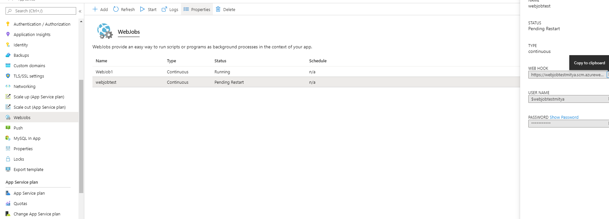

Returns warning when
* There is a missing value in the configuration fields

Returns error when
* The webjob state is not 'running'

#### Queues

|Fields|Description|
|---|---|
|Database|Sets the database. (Master, Core, Web)|
|Table| Sets the table. (EventQueue, PublishQueue, History)|
|Warn Count| Number of records after a warning returns|
|Error Count| Number of records after an error returns|

The queue check gets the records count in the configured database-table pair.

Returns warning when: 
* The fields are not configured correctly
* Then the records count >=Warn Count and records count <Error Count

Returns error when
* The record count > Error Count

#### Custom

|Field|Description|
|--|---|
|Type| The type of the custom healthcheck implementation. e.g "YourNameSpace.YourClass, YourAssemblyName"|
|Parameters|A Name value collection which can be passed to your implementation|

The healthcheck calls the DoHealthcheck method in your implementation and saves the state to the Custom Healthcheck item. 

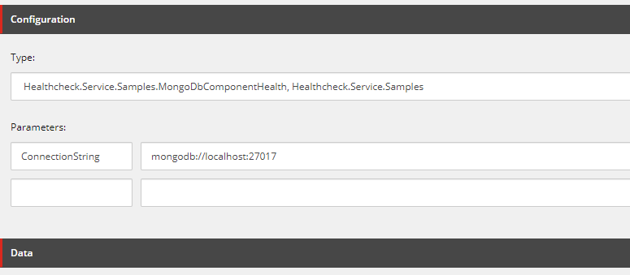
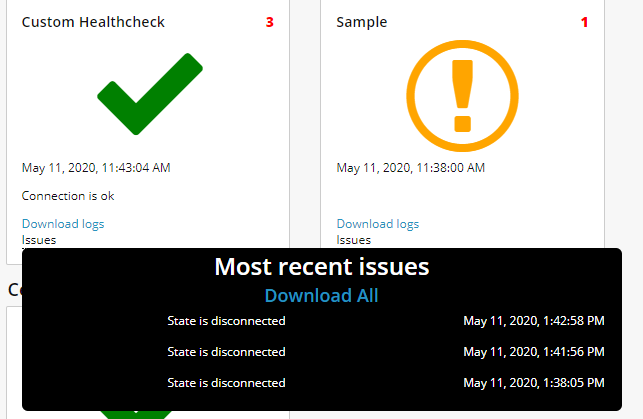

##### How to implement custom healthcheck

* Include Healthcheck.Service.Customization dll in your project.
* Create a new class, inherit from **CustomHealthcheckRun** class
* Override the **DoHealthcheck** method
* Return type of the DoHealthcheck method is **CustomHealthcheckResult**

The CustomHealthcheck result has the following properties.

|Property|Description|
|--|--|
|State|HealthcheckStatus enum, it can be Error, Warning, Healthy|
|ErrorMessage| The message which will be displayed in case of an error|
|HealthyMessage| The message which will be displayed in case of healthy component|
|Exception| Any exception which will be stored and displayed in the healthcheck app/report|

**Method to overwrite**

  ```csharp
   public class CustomComponentHealthy : CustomHealthcheckRun
    {
        
        public override CustomHealthcheckResult DoHealthcheck(NameValueCollection parameters)
        {
            var result = new CustomHealthcheckResult();

            //TODO: IMPLEMENT HERE

            return result;
        }
    }
```

**MongoDb Sample**

The following sample can be found in the project too.

  ```csharp
    /// <summary>
    /// MongoDb sample health check
    /// </summary>
    /// <seealso cref="Healthcheck.Service.Customization.CustomHealthcheckRun" />
    public class MongoDbComponentHealth : CustomHealthcheckRun
    {
        /// <summary>
        /// Does the healthcheck.
        /// </summary>
        /// <param name="parameters">The parameters.</param>
        /// <returns>
        /// The healthcheck result
        /// </returns>
        public override CustomHealthcheckResult DoHealthcheck(NameValueCollection parameters)
        {
            var connectionString = parameters["ConnectionString"];
            var result = new CustomHealthcheckResult
            {
                HealthyMessage = "Connection is ok",
                Status = HealthcheckStatus.Healthy
            };

            try
            {
                if (string.IsNullOrEmpty(connectionString))
                {
                    result.Status = HealthcheckStatus.Warning;
                    result.ErrorMessage = "Connectionstring is not provided in 'ConnectionString' param";
                    return result;
                }

                var client = new MongoClient(connectionString);

                if (client.Cluster.Description.State != MongoDB.Driver.Core.Clusters.ClusterState.Connected)
                {
                    result.Status = HealthcheckStatus.Error;
                    result.ErrorMessage = "State is disconnected";
                }
            }
            catch (Exception ex)
            {
                result.Status = HealthcheckStatus.Error;
                result.Exception = ex;
                result.ErrorMessage = ex.Message;
            }

            return result;
        }
    }
```


# Configure the developer environment

If you want to enhance or contribute into the module, you should perform the following steps to setup the codebase locally.

## How to setup the API
* It should work with Sitecore 9.0, 9.1, 9.2, 9.3
* Build the Healthcheck.Service.sln Visual Studio Solution. 
* Copy the **Healthcheck.Service.dll** and **Healthcheck.Service.Customization.dll** and pdb files into your Sitecore's bin folder. 
* Copy the Configuration files from the Healthcheck.Service\App_Config\Include\Healtcheck folder into your Sitecore instance
* Sync the items with Unicorn

## How to setup the client Application
- go to the \src\Healthcheck.Client\ folder
- make sure you are using node version 8.x
- run "npm install" in the folder
- run "npm run build" command
- Copy the DIST folder content to \sitecore\shell\client\Applications\healthcheck\ (Create the healthcheck folder)
- Open in http://sc.local/sitecore/shell/client/Applications/healthcheck/ url

